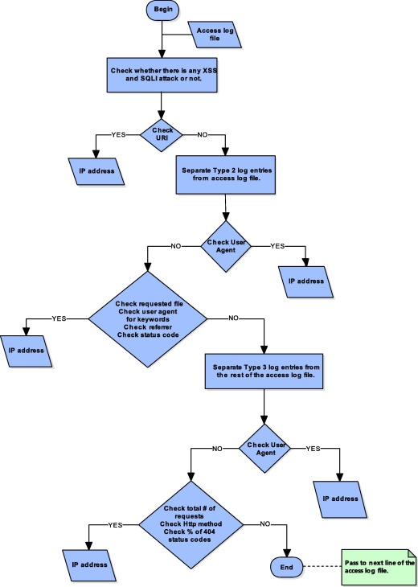

# The apache-http-logs Dataset Description
Our public dataset to detect vulnerability scans, XSS and SQLI attacks, examine access log files for detections for cyber security researchers.

**Cite The DataSet**  
If you find those results useful please cite them :
     
     @article{BASSEYYAR201828,
        title = "Detection of attack-targeted scans from the Apache HTTP Server access logs",
        journal = "Applied Computing and Informatics",
        volume = "14",
        number = "1",
        pages = "28 - 36",
        year = "2018",
        issn = "2210-8327",
        doi = "https://doi.org/10.1016/j.aci.2017.04.002",
        url = "http://www.sciencedirect.com/science/article/pii/S2210832717300169",
        author = "Merve Baş Seyyar and Ferhat Özgür Çatak and Ensar Gül",
        keywords = "Rule-based model, Log analysis, Scan detection, Web application security, XSS detection, SQLI detection",
    }

## Introduction
This study seeks to obtain data which will help to address machine learning based malware research gaps. The specific objective of this study is to build a benchmark dataset for Windows operating system API calls of various malware. This is the first study to undertake metamorphic malware to build sequential API calls. It is hoped that this research will contribute to a deeper understanding of how metamorphic malware change their behavior (i.e. API calls) by adding meaningless opcodes with their own dissembler/assembler parts.

the objectives of this study can be summarized as follows:
* to detect vulnerability scans.
* to detect XSS and SQLI attacks.
* to examine access log files for detections.

